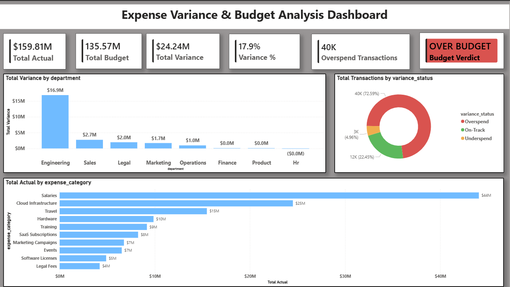
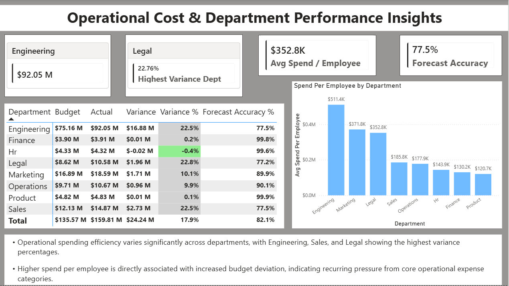
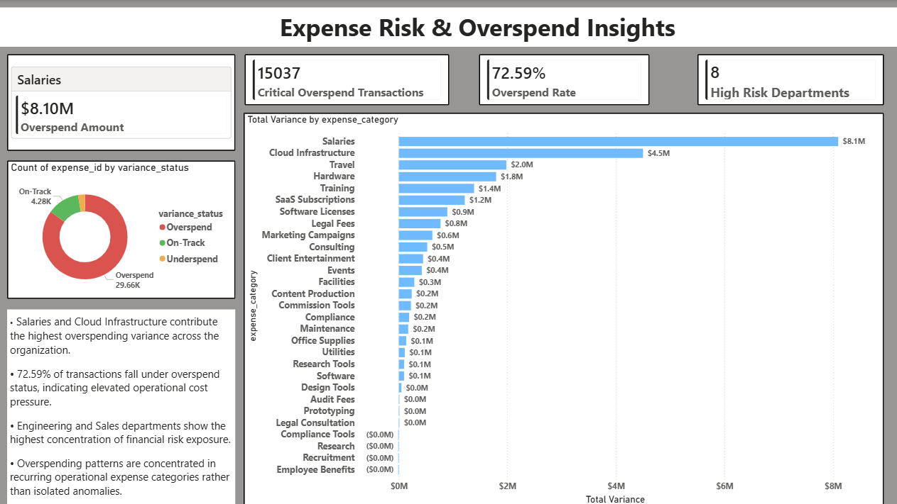

# Expense Variance & Budget Analysis Dashboard

> A financial analytics project analyzing $159.81M in operational 
> spend across 8 departments over 24 months, identifying $24.24M 
> in budget overspend and delivering CFO-ready insights using 
> Python, MySQL, and Power BI.

---

## Business Problem

A 500-person tech company spent $159.81M against a total budget of $135.57M 
over 2 years — an 17.9% overspend totalling $24.24M. The CFO needed to know 
which departments are chronically overspending, whether it is a forecasting 
problem or a spending discipline problem, and which specific expense categories 
are driving the majority of overspend — before the next board meeting.

Three questions needed answering:
- Which departments are consistently over budget and by how much?
- Is this a forecasting problem or a spending control problem?
- Which specific expense categories are driving the majority of overspend?

---

## Key Findings

- **Engineering, Sales and Legal** are chronic overspenders exceeding 
  budget by 22%+ consistently across all 24 months
- **Salaries ($8.1M) and Cloud Infrastructure ($4.5M)** account for 
  52% of total $24.24M overspend
- **Finance, HR and Product** operate within ±1% of budget — 
  serving as internal benchmarks for budget discipline
- **72.59%** of all 55,348 transactions classified as Overspend
- **Q2 shows steepest variance** driven by Marketing campaign peaks 
  and Sales travel activity
- **Forecast Accuracy** averages 82.1% across all departments — 
  Engineering and Sales score lowest at 77.5%

---

## Dashboard Preview

### Page 1 — Executive Summary


### Page 2 — Operational Cost & Department Performance


### Page 3 — Expense Risk & Overspend Insights


---

## Dataset

No public expense dataset exists since operational spending data is 
confidential in every real company. This project uses a synthetically 
generated dataset built from scratch using Python, modeled on real 
FP&A structures for a 500-person tech company.

| Attribute | Detail |
|---|---|
| Total Rows | 55,348 |
| Time Period | January 2023 — December 2024 |
| Departments | 8 |
| Expense Categories | 29 |
| Employees | 500 |
| Total Budget | $135.57M |
| Total Actual Spend | $159.81M |
| Generation Tool | Python — NumPy, Faker, Pandas |
| Random Seed | 42 (fully reproducible) |

### Department Structure

| Department | Headcount | Annual Budget | Spending Type |
|---|---|---|---|
| Engineering | 180 | $1,400,000 | Chronic Overspender |
| Sales | 80 | $820,000 | Chronic Overspender |
| Marketing | 50 | $640,000 | Seasonal Overspender |
| Operations | 60 | $480,000 | Seasonal Overspender |
| Product | 40 | $360,000 | Well Managed |
| HR | 30 | $280,000 | Well Managed |
| Finance | 30 | $160,000 | Well Managed |
| Legal | 30 | $260,000 | Chronic Overspender |

### Data Quality Issues Introduced (For Cleaning Practice)

| Issue | Count | Resolution |
|---|---|---|
| Null actual_amount | ~2% of rows | Grouped median imputation |
| Duplicate rows | 30 rows | Keep first occurrence |
| Inconsistent dept casing | ~5% of rows | Standardized to title case |
| Zero actual amounts | 10 rows | Removed |
| Negative budget rows | 5 rows | Removed |

---

## Methodology

### 1. Data Generation
Synthetic dataset created using Python with realistic patterns:
- Seasonal budget weights (Q4 highest at 10.5%, Q1 lowest at 5.5%)
- Three spending behavior types built in deliberately
- Employee-level records (500 employees × 4-6 expenses/month)
- Intentional data quality issues for cleaning practice

### 2. Data Cleaning
- Null imputation using grouped median by department and expense category
- Duplicate detection and removal
- Department name standardization
- Zero and negative value removal
- Outlier flagging using IQR method (flag only — not removed)
- Derived column recalculation after all fixes

### 3. Feature Engineering
New columns created during analysis:
- `variance_severity` — Critical / Moderate / Mild Overspend / Normal
- `budget_utilization_pct` — Actual ÷ Budget × 100
- `utilization_category` — Critical Over Utilized to Critically Under Utilized
- `expense_band` — Low / Medium / High / Critical Spend

### 4. SQL Analysis
10 analytical queries covering variance classification, trend analysis,
forecasting accuracy, and risk flagging.

### 5. Visualization
3-page Power BI dashboard with conditional formatting, KPI cards,
matrix tables, and insight annotations.

---

## SQL Analysis

10 queries written in MySQL covering:

| Query | Technique Used |
|---|---|
| Budget Variance Classification | GROUP BY + CASE WHEN |
| Top 10 Overspend Categories | CTEs + RANK() window function |
| Month-over-Month Trend | LAG() window function |
| Forecasting Accuracy Score | Nested aggregations |
| Expense Per Employee | RANK() OVER PARTITION BY |
| Annual Summary | Multi-condition aggregation |
| Quarterly Variance Trend | RANK() OVER PARTITION BY quarter |
| Approver Level Analysis | FIELD() ordering |
| Variance Severity Distribution | Window function on aggregated result |
| High Risk Expense Flagging | Multi-condition WHERE clause |

See `sql/expense_queries_final.sql` for all queries with comments.

---

## Recommendations

Based on the analysis, 6 specific recommendations were identified:

1. **Implement Hard Budget Caps for Engineering** — Monthly budget 
   reviews with CTO and hard caps for cloud spend above $8,000 per 
   submission
2. **Introduce Pre-Approval for High-Risk Categories** — Mandatory 
   CFO pre-approval for Salaries, Cloud Infrastructure, and Legal 
   Fees above $10,000
3. **Replicate Finance, HR and Product Best Practices** — Document 
   and roll out their budgeting methodology to Engineering and Sales
4. **Seasonal Budget Adjustment for Marketing and Operations** — 
   Front-load Q2 and Q4 budgets to avoid technical overspend against 
   flat monthly allocations
5. **Automate Variance Alerts** — Flag departments reaching 90% 
   budget utilization within a quarter for early intervention
6. **Audit Legal Fees and Consulting** — Formal vendor review and 
   contract renegotiation for Legal's 22.8% chronic overspend

---

## Project Structure

```
expense-variance-project/
│
├── data/
│   ├── expense_data_raw.csv
│   └── expense_data_cleaned_final.csv
│
├── notebooks/
│   └── Expense_Variance_Budget_Analysis.ipynb
│
├── sql/
│   └── expense_queries_final.sql
│
├── dashboard/
│   └── Dashboard.pbix
│
├── reports/
│   └── Expense_Variance_Budget_Analysis_Report.pdf
│
├── screenshots/
│   ├── page1.png
│   ├── page2.png
│   └── page3.png
│
├── generate_dataset.py
└── README.md
```

---

## Tools Used

| Tool | Purpose |
|---|---|
| Python 3.x | Dataset generation and data cleaning |
| Pandas | Data manipulation and transformation |
| NumPy | Synthetic data generation and statistics |
| Faker | Realistic employee name generation |
| Matplotlib / Seaborn | Exploratory data visualization |
| SciPy | Statistical analysis and outlier detection |
| MySQL Workbench | SQL analytical queries |
| Power BI Desktop | Interactive 3-page dashboard |

---

## How To Run

### Prerequisites
```bash
pip install pandas numpy faker matplotlib seaborn scipy sqlalchemy
```

### Step 1 — Generate Dataset
```bash
python generate_dataset.py
```
Creates `data/expense_data_raw.csv` and 
`data/expense_clean_reference.csv`

### Step 2 — Run Cleaning and Analysis Notebook
```bash
jupyter notebook
```
Open `notebooks/Expense_Variance_Budget_Analysis.ipynb`
Run all cells sequentially from top to bottom

### Step 3 — Run SQL Queries
- Import `data/expense_data_cleaned_final.csv` into MySQL
- Create database: `CREATE DATABASE expense_analysis;`
- Run queries from `sql/expense_queries_final.sql` one by one

### Step 4 — Open Dashboard
- Open `dashboard/Dashboard.pbix` in Power BI Desktop
- Reconnect to `data/expense_data_cleaned_final.csv` if prompted
- All 3 pages load automatically

---

## Resume Bullet

> Built a financial expense variance dashboard analyzing $159.81M 
> in operational spend across 8 departments and 55K+ records using 
> Python, MySQL window functions, and Power BI, identifying Salaries 
> and Cloud Infrastructure as drivers of 52% of total $24.24M 
> overspend and delivering a CFO-ready variance report with 6 
> actionable budget control recommendations.


---

## Author

**Shrey Aggrawal**  


---

*Generated from synthetic dataset created for analytical 
demonstration purposes. All figures in USD.*
